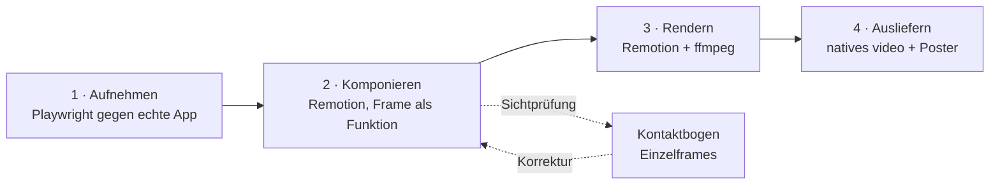

# Produktfilm-Playbook — codegetriebene Produktfilme mit Remotion und Playwright

**Zweck.** Dieses Dokument beschreibt vollständig, wie in diesem Repository der
Landingpage-Produktfilm entsteht, und verallgemeinert das Verfahren so, dass ein
anderer Agent damit Filme für andere Zwecke bauen kann — Feature-Ankündigung,
Investorenmaterial, Onboarding, Changelog, Social-Clip.

**Kernidee in einem Satz.** Nicht den Bildschirm abfilmen, sondern *echte
Produkt-Screenshots automatisiert aufnehmen* und *die Kamerafahrt als Code*
darüber legen — dadurch ist der Film reproduzierbar, versionierbar,
diff-fähig und ohne Videoschnittprogramm änderbar.

---

## 1. Wann dieses Verfahren richtig ist — und wann nicht

| Verfahren | Stärke | Schwäche | Nimm es, wenn |
|---|---|---|---|
| **Screencast** (QuickTime, Loom) | schnell, null Setup | nicht reproduzierbar, Mauszittern, Neuaufnahme bei jeder UI-Änderung | einmalig, intern, Wegwerf |
| **After Effects / Motion** | maximale gestalterische Freiheit | Binärdatei, kein Diff, Lizenz, Spezialist nötig, Produkt-UI wird nachgebaut statt gezeigt | Marken-Spot ohne echtes Produkt |
| **Lottie / SVG-Animation** | winzig, skalierbar, im DOM | ungeeignet für Screenshots und Tiefenschärfe | Icons, Mikrointeraktionen |
| **Dieses Verfahren** (Playwright + Remotion) | reproduzierbar, im Git, echtes Produkt, zwei Formate aus einer Quelle | Build-Kette nötig, Renderzeit, Lizenzfrage | Produktfilm, der das echte Produkt zeigt und den UI-Stand überlebt |

**Nicht nehmen**, wenn der Film Live-Interaktion braucht (dann `@remotion/player`
oder echte UI), oder wenn kein echtes Produkt existiert, das man zeigen könnte.

---

## 2. Das Verfahren in vier Stufen



Die Trennung ist der Punkt: **Stufe 1 liefert Wahrheit (echte Oberfläche),
Stufe 2 liefert Erzählung (Kamera, Text, Rhythmus).** Ändert sich das Produkt,
läuft nur Stufe 1 neu. Ändert sich die Erzählung, nur Stufe 2.

---

## 3. Werkzeuge und Fassungen

### 3.1 Die Renderkette

| Werkzeug | Fassung hier | Rolle |
|---|---|---|
| `remotion` / `@remotion/cli` | ^4.0.520 | Komposition und Rendering |
| `@playwright/test` (chromium) | ^1.48.2 | Frame-Aufnahme aus der echten App |
| `ffmpeg` | System | Remux auf `faststart`, Poster-Extraktion |
| `@fontsource-variable/*` | ^5.3.0 | Schriften, die im Renderer verfügbar sein müssen |
| Node | 20+ | Laufzeit der Skripte |

> **Lizenz vor Auslieferung prüfen.** Remotion steht unter einer eigenen
> Lizenz, die für Unternehmen ab einer bestimmten Grösse eine kostenpflichtige
> Company License verlangt. Das ist keine gewöhnliche MIT-Lage. Vor
> kommerzieller Nutzung die aktuellen Bedingungen auf remotion.dev prüfen und
> die Entscheidung dokumentieren. `ffmpeg`-Builds können je nach Herkunft
> zusätzlich Codec-Fragen aufwerfen (H.264/AVC).

### 3.2 Gestaltungs-Skills im Repository

Unter `frontend/design-skills/` liegen vierzehn Skill-Dateien — Anweisungstexte
für einen Agenten, keine ausführbare Software. Sie entscheiden über die
*Gestaltung* des Films, während Abschnitt 5 bis 7 nur die Mechanik regeln.

| Datei | `name` im Frontmatter | Wofür | Für Filmarbeit |
|---|---|---|---|
| `taste-skill.md` | `design-taste-frontend` | Anti-Slop-Leitfaden für Landingpages; Brief lesen, dann drei Regler setzen | **zentral** |
| `taste-skill-v1.md` | `design-taste-frontend-v1` | Eingefrorene Vorfassung, nur für Rückwärtskompatibilität | nein |
| `output-skill.md` | `full-output-enforcement` | Verbietet Auslassungen wie `// rest of code`, erzwingt vollständige Ausgabe | **ja** |
| `soft-skill.md` | `high-end-visual-design` | Schriften, Abstände, Schatten, Karten, Animationen einer teuren Agentur | ja |
| `minimalist-skill.md` | `minimalist-ui` | Editorial, warmes Monochrom, flache Bento-Raster, keine Verläufe | ja |
| `brutalist-skill.md` | `industrial-brutalist-ui` | Schweizer Satz trifft Terminalästhetik, harte Raster | alternativ |
| `brandkit.md` | `brandkit` | Markenbögen, Logosysteme, Identitätsdecks als Bild | Schlussbild, Poster |
| `imagegen-frontend-web.md` | `imagegen-frontend-web` | Web-Designreferenzen erzeugen | Vorentwurf |
| `imagegen-frontend-mobile.md` | `imagegen-frontend-mobile` | App-native Screenkonzepte und Flüsse | Vorentwurf 4:5 |
| `image-to-code-skill.md` | `image-to-code` | Erst Bild erzeugen, analysieren, dann danach bauen | nein |
| `redesign-skill.md` | `redesign-existing-projects` | Bestand auditieren, generische KI-Muster entfernen | nein |
| `stitch-skill.md` | `stitch-design-taste` | Erzeugt agentenlesbare `DESIGN.md`-Dateien | nein |
| `stitch-DESIGN-vorlage.md` | — | Vorlage dazu, ohne Frontmatter | nein |
| `gpt-tasteskill.md` | `gpt-taste` | GSAP-Motion, AIDA-Struktur, ScrollTrigger | **siehe Warnung** |

**Die drei Regler aus `taste-skill.md` übertragen sich direkt auf den Film.**
Die Skill setzt `DESIGN_VARIANCE`, `MOTION_INTENSITY` und `VISUAL_DENSITY`
(Grundwert 8 / 6 / 4). Für eine Kamerafahrt heißt das konkret:

| Regler | Wirkung im Film |
|---|---|
| `MOTION_INTENSITY` | Zoomhub, Neigungswinkel, Anzahl der Kamerarampen. 2–3 heißt fast statisch, 8–10 heißt kinematisch |
| `DESIGN_VARIANCE` | Wie unsymmetrisch Text und Bild im Rahmen sitzen |
| `VISUAL_DENSITY` | Wie viele Overlay-Ebenen gleichzeitig stehen dürfen |

Die Skill schreibt außerdem vor, **vor** der ersten Zeile Code einen
einzeiligen *Design Read* auszugeben — «Reading this as: \<Art> für
\<Publikum>, mit \<Vibe>». Für einen Film ist das die Entsprechung des
Exposés und sollte als Kommentarkopf in der Komposition stehen.

Ihre Anti-Default-Liste gilt unverändert auch bewegt: keine KI-Lila-Verläufe,
kein zentrierter Held über dunklem Mesh, keine Glasmorphie auf allem, keine
endlos schleifenden Mikroanimationen.

> **Warnung: zwei Skills widersprechen sich.** `gpt-tasteskill.md` schreibt
> GSAP mit ScrollTrigger vor. Die geprüfte Werkzeugentscheidung in
> `docs/product/reference/animationswerkzeuge_2026-08-30.md` verbietet GSAP in
> diesem Baum ausdrücklich (Begründung in 3.4). Wer `gpt-taste` benutzt, tut
> das für Struktur und Typografie, nicht für die Bewegungsbibliothek. Für
> Remotion ist die Frage ohnehin gegenstandslos: dort animiert niemand
> über eine Laufzeitbibliothek, sondern über `useCurrentFrame()`.

### 3.3 Mess- und Prüfskripte

Unter `frontend/scripts/` liegen kleine Node-Skripte, die alle nach demselben
Muster arbeiten: echtes Chromium starten, messen statt schätzen. Für Filmarbeit
sind sie die Qualitätssicherung **vor** der Aufnahme — was auf der Seite falsch
sitzt, sitzt im Film falsch.

| Skript | Was es tut |
|---|---|
| `shot.mjs` | Screenshots mehrerer Pfade in vier Viewports (`handy`, `tablet`, `klein`, `desktop`); sammelt nebenbei Konsolen- und Seitenfehler |
| `messen.mjs` | Liest echte Geometrie aus dem Browser — Kastenmaße, `max-height`, CSS-Variablen, Fensterhöhe |
| `leerraum.mjs` | Misst den Leerraumanteil einer Seite über ein Pixelraster: jede Textzeile und Grafik wird als Kasten aufgenommen, jede Bildzeile ohne Schnitt gilt als leer |
| `pitch_shots.mjs` | Screenshotserie für Pitch-Material |
| `product_pdf.mjs` | PDF aus Produktdokumenten, verdrahtet als `npm run docs:broker-pdf` |
| `pitch_pdf.mjs`, `a4_pdf.mjs` | PDF-Ausgabe für Pitch und A4-Seiten |
| `probe*.mjs`, `*-tmp.mjs` | Wegwerfsonden aus einzelnen Sitzungen — **keine Schnittstelle**, nicht darauf aufbauen |

`leerraum.mjs` ist für Filmarbeit der nützlichste: ein Bildausschnitt, der zu
voll ist, wird beim Hineinzoomen unlesbar, und ein zu leerer wirkt in Bewegung
wie ein Ladefehler.

### 3.4 Bewegungsbibliotheken: geprüft und verworfen

`docs/product/reference/animationswerkzeuge_2026-08-30.md` prüft 17 Kandidaten
mit Belegstufen (selbst abgerufen / Websuche / Ableitung), gemessenen
gzip-Größen und Lizenznachweis. Die Urteile sind auch für andere Projekte
brauchbar, weil sie Fallen benennen, die man sonst erst im Audit findet:

| Kandidat | Befund |
|---|---|
| **GSAP** | Seit 30.04.2025 kostenlos inklusive aller Plugins, **aber nicht quelloffen**: npm verweist auf eine Standardlizenz, das Repository hat keine LICENSE-Datei, die GitHub-API meldet `license: null`. Der Vertrag ist widerrufbar und verbietet Konkurrenz zu Webflows Animationsbauer |
| **Rive** | MIT, aber 94,5 KB JS **plus 747,6 KB wasm** gzip |
| **Lottie** | MIT, 115 KB gzip; animiert Pfade, Füllungen und Masken — also gerade nicht nur `transform` und `opacity` |
| **Aceternity UI** | Lizenz **nicht prüfbar**: eigene Lizenzseite, das Wort MIT kommt darin nicht vor, kein öffentliches Repository mit Lizenzdatei |
| **React Bits, Animate UI** | MIT **plus Commons Clause**, GitHub meldet `NOASSERTION` — nicht MIT |
| **split-type** | ISC laut npm, aber keine LICENSE-Datei und `license: null`; seit über zwei Jahren ohne Commit |
| **@react-three/fiber 9.x** | Peer ist React ≥ 19 — auf React 18 bliebe ein eingefrorener Zweig |

**Die übertragbare Lehre:** Größe und Lizenz selbst messen, nicht der
Suchmaschine glauben. Der npm-Tarball und die GitHub-API sind die Belege; ein
Blogeintrag ist keiner. Für einen offline gerenderten Film ist die Laufzeitgröße
zwar gleichgültig — die **Lizenzfrage bleibt** aber, weil der Code im
Repository liegt und ausgeliefert wird.

---

## 4. Verzeichnisaufbau

```text
frontend/
  remotion.config.ts          Render-Vorgaben (Codec, CRF, publicDir, Parallelität)
  video/
    index.tsx                 Einstieg: Schriften laden, registerRoot
    root.tsx                  Kompositionen (Format, fps, Dauer, Masse)
    MeritProduktfilm.tsx      Die Komposition selbst
    capture.mjs               Stufe 1 — Playwright-Aufnahme
    render.mjs                Stufe 3 — Render + ffmpeg
    public/frames/            Aufgenommene PNGs (Eingang für staticFile)
    review/                   Kontaktbogen und Vorschau zur Sichtprüfung
  public/media/produktfilm/   Ausgang: mp4 + jpg (wird ausgeliefert)
  src/app/seiten/ProduktVideo.tsx   Stufe 4 — Einbettung
```

Skripte in `frontend/package.json`:

```json
"video:capture": "node video/capture.mjs",
"video:studio":  "remotion studio video/index.tsx",
"video:render":  "node video/render.mjs"
```

`video:studio` ist der interaktive Editor mit Zeitleiste — dort arbeitet man,
`video:render` ist nur der Abschluss.

---

## 5. Stufe 1 — Frames aufnehmen

### Prinzip

Ein Node-Skript startet bei Bedarf den Dev-Server, fährt mit Chromium auf die
App, stellt jede Szene her und schiesst einen Screenshot des relevanten
Ausschnitts.

### Vorlage

```js
import { spawn } from 'node:child_process'
import { mkdir } from 'node:fs/promises'
import { fileURLToPath } from 'node:url'
import { chromium } from '@playwright/test'

const basis = process.env.VIDEO_BASE_URL ?? 'http://localhost:5173'
const ziel = fileURLToPath(new URL('./public/frames/', import.meta.url))

// Ein Eintrag je Szene: Dateiname + wie der Zustand hergestellt wird.
const szenen = [
  { datei: 'suchen',      herstellen: async (seite) => { /* navigieren, tippen, warten */ } },
  { datei: 'verstehen',   herstellen: async (seite) => { /* ... */ } },
]

async function aufnehmen(browser, name, viewport, deviceScaleFactor) {
  const kontext = await browser.newContext({
    viewport,
    deviceScaleFactor,
    reducedMotion: 'no-preference', // sonst zeigt die App ihren Standbild-Zustand
    colorScheme: 'light',
  })
  const seite = await kontext.newPage()
  await seite.goto(basis, { waitUntil: 'networkidle' })

  // Alles wegräumen, was im Bild nichts zu suchen hat.
  const banner = seite.getByRole('button', { name: 'Ablehnen' })
  if (await banner.isVisible()) await banner.click()

  for (const szene of szenen) {
    await szene.herstellen(seite)
    await seite.getByTestId('buehne').screenshot({
      path: `${ziel}/${name}-${szene.datei}.png`,
      animations: 'disabled',
    })
  }
  await kontext.close()
}

await mkdir(ziel, { recursive: true })
const browser = await chromium.launch()
try {
  await aufnehmen(browser, 'desktop', { width: 1600, height: 1000 }, 2)
  await aufnehmen(browser, 'mobile',  { width: 390,  height: 844  }, 3)
} finally {
  await browser.close()
}
```

### Die fünf Regeln, an denen es sonst scheitert

1. **`deviceScaleFactor` grösser wählen, als die Endauflösung nahelegt.**
   Die Kamera zoomt später bis etwa 1,3-fach hinein. Wer 1:1 aufnimmt, sieht im
   Zoom Pixelmatsch. Hier: Desktop 1600 × 1000 bei Faktor 2 → 3200 × 2000 echte
   Pixel für ein 1920er Bild. Mobil Faktor 3.
2. **`reducedMotion: 'no-preference'` setzen.** Eine gut gebaute App zeigt bei
   `reduce` bewusst Standbilder — genau das will man in der Aufnahme *nicht*.
3. **`animations: 'disabled'` am Screenshot.** Sonst erwischt man einen
   Zwischenzustand einer laufenden Übergangsanimation.
4. **Störer entfernen:** Cookie-Banner, Toasts, blinkende Cursor, laufende
   Videos pausieren. Was im Screenshot ist, ist im Film.
5. **Keine echten Personendaten.** Die Frames landen im Repository und im
   öffentlichen Bundle. Demo-Konto verwenden, Beträge und Namen prüfen.

### Der Selektor-Vertrag — hier liegt die häufigste Fehlerquelle

Das Aufnahmeskript hängt an `data-testid` und Rollennamen der App. Ändert das
Produktteam diese, bricht die Aufnahme **still**, und niemand merkt es, weil die
alten PNGs noch im Ordner liegen und `video:render` weiterhin durchläuft.

> **Belegter Fall in diesem Repository (Stand 15.09.2026).**
> `frontend/video/capture.mjs` sucht `produkt-film` und `produkt-film-buehne`
> sowie Knöpfe „Produktfilm pausieren". Diese Kennungen existieren in `src/`
> **nicht mehr**; die heutige Komponente
> `frontend/src/app/seiten/ProduktVideo.tsx` trägt `produkt-video` und
> `produkt-video-buehne`. `npm run video:capture` läuft damit ins Leere. Die
> acht PNGs unter `video/public/frames/` stammen aus der abgelösten
> interaktiven Filmkomponente. Der gerenderte Film ist deshalb nicht falsch,
> aber er ist **eingefroren** und bildet UI-Änderungen nicht mehr ab.

**Gegenmittel, eines davon verbindlich wählen:**

- Die im Film benutzten Testids in einer Konstantendatei führen, die *sowohl*
  die App *als auch* `capture.mjs` importiert.
- Oder einen E2E-Test, der genau diese Selektoren anfasst, damit ihr
  Verschwinden die Suite rot macht.
- Oder `capture.mjs` hart scheitern lassen (`await expect(el).toBeVisible()`
  statt `if (await el.isVisible())`), damit ein fehlender Selektor einen
  Exit-Code ungleich null erzeugt.

---

## 6. Stufe 2 — Komponieren

### Das mentale Modell: Frame als reine Funktion

Remotion animiert **nicht** über Timer oder CSS-Transitions. Jeder Frame ist
eine reine Funktion des Zählers:

```tsx
const frame = useCurrentFrame()      // 0 … durationInFrames-1
const opacity = interpolate(frame, [0, 10], [0, 1], clamp)
```

Daraus folgt alles Weitere: Frames sind unabhängig, also parallel renderbar,
also auch einzeln als Standbild prüfbar. **Niemals** `setTimeout`,
`requestAnimationFrame`, `useState`-Animation oder CSS-`transition` verwenden —
das rendert nicht deterministisch.

### Kompositionen definieren

```tsx
// root.tsx
const FPS = 30
const DAUER = 12 * FPS   // 360 Frames

<Composition id="FilmDesktop" component={Film} durationInFrames={DAUER}
  fps={FPS} width={1920} height={1080} defaultProps={{ format: 'desktop' }} />
<Composition id="FilmMobile"  component={Film} durationInFrames={DAUER}
  fps={FPS} width={1080} height={1350} defaultProps={{ format: 'mobile' }} />
```

**Eine Komponente, zwei Formate über `defaultProps`.** Im Bauteil überall
`const mobil = format === 'mobile'` und Masse als Ternär. Das spart eine zweite
Wahrheit und hält die Formate synchron.

Masse und Dauer:

| Zweck | Mass | Verhältnis |
|---|---|---|
| Web/Desktop, YouTube | 1920 × 1080 | 16:9 |
| Social, Mobile-Feed | 1080 × 1350 | 4:5 |
| Story/Reel | 1080 × 1920 | 9:16 |

fps 30 genügt für UI-Filme; 60 verdoppelt Renderzeit und Dateigrösse ohne
sichtbaren Gewinn bei langsamen Kamerafahrten. **Breite und Höhe müssen gerade
sein** — `yuv420p` verlangt es.

**Dauerdisziplin:** 12 Sekunden. Ein Produktfilm auf einer Landingpage wird
nicht zu Ende gesehen; die Aussage muss in den ersten 4 Sekunden stehen.

### Szenen als überlappende Frame-Bereiche

```tsx
const SZENEN = [
  { id: 'suchen',      start:   0, ende:  92, titel: 'Suchen',     nummer: '01' },
  { id: 'filtern',     start:  80, ende: 164, titel: 'Verstehen',  nummer: '02' },
  { id: 'verstehen',   start: 148, ende: 274, titel: 'Einordnen',  nummer: '03' },
  { id: 'bestaetigen', start: 258, ende: 360, titel: 'Bestätigen', nummer: '04' },
]
```

Die Überlappung von 12–16 Frames **ist** die Überblendung. Remotions
`<Sequence>` wäre die Alternative, schneidet aber hart — für Kreuzblenden ist
die manuelle Bereichsrechnung einfacher.

Standard-Blendkurve, vier Stützstellen:

```tsx
const opacity = interpolate(
  frame,
  [szene.start, szene.start + 14, szene.ende - 14, szene.ende],
  [0, 1, 1, 0],
  clamp
)
```

### `interpolate` richtig benutzen

```tsx
const clamp = { extrapolateLeft: 'clamp', extrapolateRight: 'clamp' } as const
```

**Immer klemmen.** Ohne `clamp` extrapoliert Remotion linear weiter und das Bild
fliegt aus dem Rahmen, sobald der Frame ausserhalb des Eingangsbereichs liegt.

| Bedürfnis | Mittel |
|---|---|
| Weiches Ein- und Ausgleiten | `easing: Easing.inOut(Easing.cubic)` |
| Ankommen, nicht starten | `easing: Easing.out(Easing.cubic)` |
| Skalierung | zusätzlich `output: 'perceptual-scale'` |
| Physikalisches Nachfedern | `spring({ frame, fps, config: { damping, stiffness } })` |

**`output: 'perceptual-scale'` ist der wichtigste unbekannte Schalter.** Eine
lineare Interpolation von `scale` 0,8 → 1,2 wirkt in der Mitte langsam und am
Ende hastig, weil Wahrnehmung von Grösse logarithmisch ist. Der Schalter
korrigiert das. Jede `scale`-Interpolation bekommt ihn.

### Die Kamera — ein einziger Transform

Der gesamte Kamerablick ist **ein** CSS-Transform auf **einem** Container:

```tsx
transform: `perspective(1800px) translate3d(${x}px, ${y}px, 0)
            rotateX(${neigungX}deg) rotateY(${neigungY}deg) scale(${scale})`
```

Reihenfolge beachten — `perspective` zuerst, `scale` zuletzt. Alle fünf Werte
sind `interpolate`-Ausgaben über den Frame.

**Zoomrampen verketten statt eine lange Rampe:** je Szene eine eigene Rampe,
deren Startwert der Endwert der vorigen ist, danach über Frame-Schwellen
auswählen:

```tsx
const scale = frame < 80  ? suchZoom
            : frame < 150 ? filterZoom
            : frame < 260 ? detailZoom
            : orderZoom
```

Das gibt je Szene eine eigene Bewegungsabsicht (hineingehen, herausgehen,
verweilen), statt monoton durchzuziehen.

**Neigung sparsam.** Start bei 7° / −8°, danach Werte um ±1,4°. Eine leichte
Rest-Neigung wirkt lebendig; alles über 10° sieht nach Werbetemplate aus.

### Übergangsunschärfe statt Hartschnitt

```tsx
const wechsel = Math.min(Math.abs(frame - szene.start), Math.abs(frame - szene.ende))
const blur = interpolate(wechsel, [0, 10], [10, 0], clamp)
style={{ filter: `blur(${blur}px) saturate(0.94)` }}
```

Der Abstand zur nächsten Szenengrenze steuert die Unschärfe. Am Schnittpunkt
maximal, zehn Frames später null. Kostet Renderzeit — sparsam einsetzen.

### Textebenen

Regeln, die sich bewährt haben:

- **Text niemals aus dem Screenshot lesen lassen.** Die aufgenommene UI ist im
  Zoom teils unlesbar. Jede Aussage, die ankommen muss, ist eine eigene
  Overlay-Ebene in grosser Schrift.
- **Gestaffelt einblenden.** Mehrere Elemente nie gleichzeitig:
  `const start = basis + index * 7` — sieben Frames Versatz je Element.
- **Bewegung nur `opacity` und `transform`.** Alles andere kostet Layout.
- **Lesbarkeit erzwingen:** halbtransparente Hintergrundfläche oder
  `boxShadow` als Weichzeichner hinter dem Text, sonst verschwindet er auf
  hellen Screenshot-Stellen.
- **Untergrenze Schriftgrösse:** bei 1080er Höhe nicht unter etwa 20 px, sonst
  ist es auf dem Telefon nicht lesbar.

### Schriften

```tsx
// index.tsx — MUSS im Einstieg stehen, nicht in der Komposition
import '@fontsource-variable/plus-jakarta-sans'
import '@fontsource-variable/syne'
import { registerRoot } from 'remotion'
registerRoot(VideoRoot)
```

Wird die Schrift erst in der Komposition importiert, rendert der erste Frame
gelegentlich mit Fallback-Schrift und der Film flackert im ersten Moment.

---

## 7. Stufe 3 — Rendern und kodieren

### Konfiguration

```ts
// remotion.config.ts
Config.setPublicDir('./video/public')  // Wurzel für staticFile()
Config.setCodec('h264')
Config.setCrf(21)                      // 18 = sehr gut, 23 = Standard, 28 = sparsam
Config.setPixelFormat('yuv420p')       // ohne das: kein Safari, kein QuickTime
Config.setMuted(true)
Config.setJpegQuality(95)
Config.setConcurrency(4)
Config.setOverwriteOutput(true)
```

### Renderskript

```js
ausfuehren('npx', ['remotion', 'render', 'video/index.tsx', komposition,
  `${ausgabe}/${datei}`, '--codec=h264', '--crf=21',
  '--pixel-format=yuv420p', '--muted'])

// Remux: verschiebt den Index an den Dateianfang → Wiedergabe startet sofort
ausfuehren('ffmpeg', ['-y', '-i', quelle, '-c', 'copy',
  '-movflags', '+faststart', ziel])

// Poster aus dem Film selbst, nicht aus einem Extra-Screenshot
ausfuehren('ffmpeg', ['-y', '-ss', '1.4', '-i', video, '-frames:v', '1',
  '-update', '1', '-vf', `scale=${breite}:-2`, '-q:v', '2', poster])
```

Drei Punkte, die man sonst vergisst:

1. **`+faststart` ist nicht optional** für Web-Auslieferung. Ohne es lädt der
   Browser erst die ganze Datei, bevor das erste Bild erscheint.
2. **Poster aus dem Film schneiden**, nicht separat erzeugen — sonst gibt es
   beim Übergang Poster → erster Frame einen sichtbaren Sprung. Zeitpunkt
   bewusst wählen (hier 1,4 s, also nach dem Einflug).
3. **`scale=breite:-2`**, nicht `-1` — `-2` erzwingt gerade Höhe.

### Grössenbudget

Eine Landingpage verträgt für den Film etwa **2–4 MB**. Wenn es mehr wird:
CRF erhöhen (23–25), Dauer kürzen, Unschärfe-Ebenen reduzieren, Auflösung auf
1600 × 900 senken. Prüfen: `ls -lh public/media/…`.

---

## 8. Stufe 4 — Ausliefern

Im Browser läuft **kein** Remotion und **kein** Canvas, sondern ein natives
Videoelement. Die Regeln:

```tsx
<video muted loop playsInline preload="metadata"
       src={medium.video} poster={medium.poster} />
```

| Anforderung | Umsetzung |
|---|---|
| Autoplay erlaubt | `muted` + `playsInline` (ohne beides blockt iOS) |
| Kein unnötiger Traffic | `preload="metadata"` |
| Nicht im Hintergrund laufen | `IntersectionObserver`, Schwelle 0,3 → ausserhalb pausieren |
| Format je Gerät | `matchMedia('(max-width: 639px)')` wählt Quelle, `key={src}` erzwingt Neuaufbau |
| Bedienbarkeit | eigener Pause-Knopf, ≥ 44 × 44 px, `aria-controls`, wechselndes `aria-label` |
| **Reduced Motion** | **gar kein `<video>` rendern** — stattdessen `<picture>`-Poster plus `sr-only`-Transkript |
| Kein Layout-Sprung | feste `aspect-ratio` am Element |

Das Transkript ist Pflicht, nicht Kür: Ein Film ohne Ton, der Produktaussagen
trifft, braucht eine Textentsprechung für Screenreader und für Nutzer mit
`prefers-reduced-motion`.

> **Fallstrick aus diesem Repo:** `aspect-ratio` zusammen mit `min-height`
> braucht auf mobilen Medienbühnen zusätzlich ein explizites `width: 100%`,
> sonst erzwingt die Mindesthöhe eine breitere Box und der Inhalt wird
> beschnitten.

---

## 9. Sichtprüfung — der Kontaktbogen

Ein 12-Sekunden-Film lässt sich nicht durch Anschauen beurteilen; man übersieht
Einzelbildfehler. Deshalb: **ausgewählte Frames als Standbilder exportieren**
und nebeneinander legen.

```bash
npx remotion still video/index.tsx MeritProduktfilmDesktop \
  video/review/desktop-112.png --frame=112
```

Sinnvolle Stützstellen sind die Szenenmitten und die Blendpunkte — in diesem
Repo `040, 112, 210, 300, 340` (siehe `frontend/video/review/`). Die
registrierten Kompositions-IDs heissen hier `MeritProduktfilmDesktop` und
`MeritProduktfilmMobile` (`frontend/video/root.tsx`).

**Prüfliste je Frame:**

- Ist der Text vollständig im Bild, nirgends angeschnitten?
- Liegt Text auf ausreichend ruhigem Untergrund?
- Sind Kanten scharf, oder sieht man Aufnahme-Pixel (→ `deviceScaleFactor` zu klein)?
- Steht der wichtigste Bildinhalt im Sichtfeld, oder hat die Kamera ihn weggefahren?
- Mobil: ist alles lesbar, wenn das Bild auf Telefonbreite schrumpft?
- Stehen im Bild echte Personendaten oder Platzhalter, die nach Fehler aussehen?

---

## 10. Anpassung an andere Zwecke

Was zu ändern ist, wenn ein anderer Film entstehen soll:

| Ziel | Zu ändern |
|---|---|
| **Anderes Produkt** | `capture.mjs`: Basis-URL, Szenenliste, Selektoren. Sonst nichts. |
| **Andere Erzählung** | `SZENEN`-Tabelle, Overlay-Bauteile, Schlussbild. Frames bleiben. |
| **Anderes Format** | neue `<Composition>` in `root.tsx` + `format`-Zweige in den Masszahlen |
| **Längerer Film** | `DAUER` und alle Frame-Zahlen. Besser: Frame-Zahlen als benannte Konstanten, nicht literal im Code |
| **Mit Ton** | `<Audio src={staticFile(...)} />`, `Config.setMuted(false)`, Codec `aac`; Lautstärke über `interpolate` ausblenden |
| **Interaktiv statt Datei** | `@remotion/player` statt Render — dann läuft die Komposition im Browser |
| **Serie/Varianten** | `defaultProps` erweitern und über `--props` je Lauf füttern; Textbausteine aus JSON |
| **Lokalisierung** | Texte in ein Objekt je Sprache, Sprache als Prop, je Sprache eine Komposition |

**Empfehlung für Wiederverwendung:** Die Frame-Zahlen (`0, 92, 80, 164 …`)
sind hier als Literale im Code verteilt. Für einen wartbaren Film gehören sie in
**eine** Tabelle, aus der sich Szenen, Titel, Kamerarampen und Overlays ableiten.
Sonst führt jede Dauer-Änderung zu einer Suchen-und-Ersetzen-Übung mit stillen
Fehlern.

---

## 11. Fallstrick-Liste

**Vorbereitung**
- [ ] Design Read in einem Satz formuliert und als Kommentarkopf abgelegt
- [ ] Drei Regler gesetzt (`MOTION_INTENSITY` steuert die Kamera, Abschnitt 3.2)
- [ ] Farben und Schriften aus den Design-Token, nicht neu erfunden
- [ ] Anti-Default-Liste geprüft: kein Lila-Verlauf, kein Mesh, keine Glasmorphie
- [ ] Lizenz jeder verwendeten Bibliothek selbst belegt, nicht gegoogelt

**Aufnahme**
- [ ] Selektoren des Aufnahmeskripts sind gegen UI-Änderungen abgesichert
- [ ] Skript scheitert laut, wenn ein Selektor fehlt (kein stilles `if`)
- [ ] `deviceScaleFactor` ≥ maximaler Kamerazoom
- [ ] `reducedMotion: 'no-preference'`, `animations: 'disabled'`
- [ ] Keine echten Personendaten, keine Banner, keine Toasts im Bild

**Komposition**
- [ ] Keine Timer, kein `useState`-Animieren, keine CSS-`transition`
- [ ] Jede `interpolate` hat `clamp`
- [ ] Jede `scale`-Interpolation hat `output: 'perceptual-scale'`
- [ ] Schriften im Einstieg importiert
- [ ] Aussagetragender Text als Overlay, nicht im Screenshot
- [ ] Breite und Höhe gerade

**Render**
- [ ] `yuv420p` gesetzt
- [ ] `+faststart`-Remux gelaufen
- [ ] Poster aus dem Film geschnitten, Zeitpunkt bewusst
- [ ] Dateigrösse im Budget

**Auslieferung**
- [ ] `muted` + `playsInline`, sonst kein Autoplay auf iOS
- [ ] Ausserhalb des Sichtfelds pausiert
- [ ] Sichtbarer Pause-Knopf ≥ 44 px mit `aria-label`
- [ ] Bei `prefers-reduced-motion` kein Videoelement, sondern Poster + Transkript
- [ ] Feste `aspect-ratio`, kein Layout-Sprung

---

## 12. Reihenfolge der Befehle

```bash
cd frontend

# 1 Frames aus der laufenden App (startet Dev-Server selbst, falls nötig)
npm run video:capture

# 2 Interaktiv gestalten, Zeitleiste, Einzelframe-Sprung
npm run video:studio

# 3 Einzelframes zur Sichtprüfung
npx remotion still video/index.tsx MeritProduktfilmDesktop \
  video/review/desktop-112.png --frame=112

# 4 Endrender beider Formate + Poster
npm run video:render

# 5 Ergebnis prüfen
ls -lh public/media/produktfilm/
```

---

## 13. Verwandtes im Repository

**Die Filmkette**

- Umsetzung Komposition: `frontend/video/MeritProduktfilm.tsx`
- Aufnahme: `frontend/video/capture.mjs` *(Selektoren veraltet, siehe Abschnitt 5)*
- Render: `frontend/video/render.mjs`
- Einbettung: `frontend/src/app/seiten/ProduktVideo.tsx`

**Gestaltung und Regeln**

- Verbindliche Gestaltungsregeln, Reduced-Motion-Haltung: `frontend/DESIGN-RULES.md`
- Gestaltungssystem der App: `frontend/src/design/DESIGN.md`
- Design-Token: `frontend/src/design/tokens.ts`, `frontend/src/design/farben.ts`
- Skill-Bibliothek: `frontend/design-skills/` (Abschnitt 3.2)
- Werkzeugurteile mit Lizenznachweis: `docs/product/reference/animationswerkzeuge_2026-08-30.md`
- UI-Stack-Entscheid: `docs/product/reference/ui_stack_entscheid_2026-08-28.md`

**Messen und Prüfen**

- Geometrie, Leerraum, Screenshots: `frontend/scripts/` (Abschnitt 3.3)
- Testhaltung: `docs/testing_doctrine.md`

**Die zweite Bewegtbild-Schicht**

- Three.js-Band der Startseite, Echtzeit statt Video: `frontend/src/app/seiten/MeritBand.tsx`

